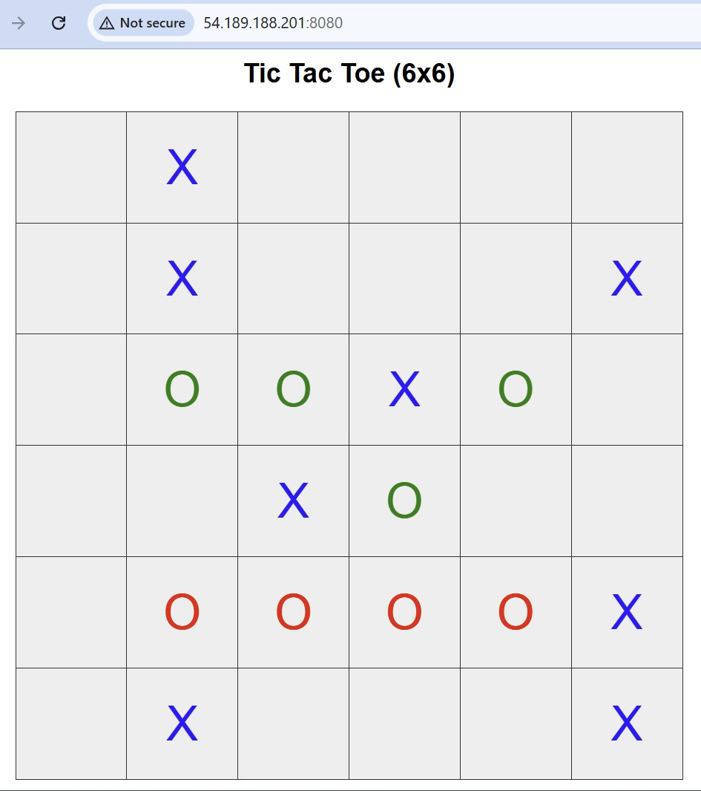

# 2025-07-09
Made Python and Cpp models match single forward and backward
To run single test case run this:
```
python3 -m unittest tests.test_game.TestTrainingCycle.test_py_cpp_models_compare --verbose
```


# 2025-11-03

After more than a month of works in `python_cpp` repo,
tha smart library is oficially ready alpha
and integrated here! Integration is two files in listinvert subdir.
First test added.

# 2025-09-22

Rounds can be shortened down to 2 (may be even 1, did not try)
The model still learns, and makes 3000 versions in two days, which
are comparable in power to previsouly more than week of training.
Win? A little, but they stop improving unfortunately. Need to add
competition, and for that temporarily switch to C++

```
python3 -m web.server --zeroes_model player:models/try_again/model-zeroes-2400.json
```

Also added colors to web page, and it become apparent that model is not
expressive enough. It is either "crossy" in mood, or "zeroi", but never
sharp colored.

# 2025-09-09

Although...
 sometimes the model even wins (when crosses are defensive):


# 2025-09-08

Made a server that really plays (for zeroes only).
And the way it plays looks really dumb lol!
Lots of work still ahead.

```
python3 -m web.server --zeroes_model player:models/fixed_rounds/model-zeroes-956.json
```

Also an idea for competition:

- We have 8 instances of models: 4 for crosses and 4 zeroes
- They split into pairs randomly, trained, and then compete everyone with everyone.
- Then they are ranked and SECOND best models are removed, and replaced with new untrained models.
  - Either completely new or mutated
- Process repeats.

This brings kind of evolution in the process.

# 2025-09-05

Added initial webserver, running on 8080

```
python web/server.py
```

# 2025-09-04

Switched to fixed rounds, with replay buffer serialization, rounded weights,
and initial parallel processing.
Trained 957 versions within 4 days (vs 7 days before), but models are huge now.
Log shows that the training efficiency is slightly ahead of "train from zero" version,
but not by far. Saving core versions and log

Interesting that while zeroes are ahead of prev version by winning, crosses are not so much.
```
$ cat output_fixed_rounds.log | grep "PREV" | grep "TION crosses" | grep  900 | perl -lnpe 's/.* - //'

PREVIOUS_BEST MODEL COMPETITION crosses v933 VS models/with_replay_buffer/model-zeroes-900.json:  {-1: 3, 0: 0, 1: 17}
PREVIOUS_BEST MODEL COMPETITION crosses v956 VS models/with_replay_buffer/model-zeroes-900.json:  {-1: 8, 0: 0, 1: 12}

$ cat output_fixed_rounds.log | grep "PREV" | grep "TION zeroes" | grep  900 | perl -lnpe 's/.* - //'

PREVIOUS_BEST MODEL COMPETITION zeroes v953 VS models/with_replay_buffer/model-crosses-900.json:  {-1: 18, 0: 0, 1: 2}
PREVIOUS_BEST MODEL COMPETITION zeroes v956 VS models/with_replay_buffer/model-crosses-900.json:  {-1: 17, 0: 0, 1: 3}

```


TODO:
- competition!
- C++ !

# 2025-08-19

Fixed batches work as good as previous "train till wins" approach.
That opens more flexible approach and possibility to play competition in the future.
Refactoring is in progress
TODO:
- serialization to dict to store more params such as version
- store replay buffer
- round all weights to 5-7 decimals
- start encapsulating so we get closer to competition
- C++ !

# 2025-08-12 

The model finally consistently wins over classifier, thanks to the replay buffer added. Running almost 1000 iterations - appr 10 days.
Ideas to check:

- Check visually how the model plays. Is it looking humanly? No, not really. But better.
- compare outputs for the same board, but flipped and rotated. If the results are equal, then the model learnt symmetry of the gam, which is a proxy to its adequacy. Logits range to put more emphasis on confident values?
   - I previously thought it would be useful to introduce "normalized" board (out of 8 equivalent positions), and thus reduce the training by 8 times, but now it feels that having them all gives some room for analysis.
- try to train predefined epochs of 10 iterations and only compete after epochs are over. Switch to next version despite the results - optionally. Maybe it will help to achieve same results faster.
- involve multi model training, selection and mutations
- time to involve C, and maybe GPU even

Log:
models/with_replay_buffer/output.log

Note: for some reason models started to fill from 0 version again, so few very first versions are overwritten.

Training
```
python3 train_from_zero.py --save_to_model models/with_replay_buffer/model
```

Playing
```
python3 generate_games.py --mode play_single_game --crosses_model classifier:models/model_victory_only.json --zeroes_model player:models/with_replay_buffer/model-zeroes-941.json


python3 generate_games.py --mode play_single_game --crosses_model player:models/with_replay_buffer/model-crosses-900.json --zeroes_model player:models/with_replay_buffer/model-zeroes-941.json
```

# 2025-06-23

Additional restrictions to amount of victory did not help. The problem is seemingly in the model forgetting what it achieved before.
Time to add "memory" in form of replay buffer - store past games and use them in training.


# 2025-06-02

If we train many-many models, and then check them against classifier model, then there is a clear fluctuation
of scores. Some models are actually capacble of winning, and we need to stabilize and enforce this:
ChatGPT suggests to generate training batches using a sample of previous versions, and keep a buffer of past games.
It also says that a requirement of winning of all prev versions is too strict, but let's see:

```
$ for i in `seq 0 5`; do echo VERSION $i; python3 generate_games.py --mode play_many_games --crosses_model classifier:models/model_victory_only.json --zeroes_model player:models/from_zero/model-zeroes-$i.json; done

VERSION 0	Zeroes: 5 out of 100
VERSION 1	Zeroes: 1 out of 100
VERSION 2	Zeroes: 13 out of 100
VERSION 3	Zeroes: 11 out of 100
VERSION 4	Zeroes: 17 out of 100
VERSION 5	Zeroes: 24 out of 100
VERSION 6	Zeroes: 18 out of 100
VERSION 7	Zeroes: 1 out of 100
VERSION 8	Zeroes: 18 out of 100
VERSION 9	Zeroes: 1 out of 100
VERSION 10	Zeroes: 6 out of 100
VERSION 11	Zeroes: 27 out of 100
VERSION 12	Zeroes: 55 out of 100
VERSION 13	Zeroes: 35 out of 100
VERSION 14	Zeroes: 28 out of 100
VERSION 15	Zeroes: 20 out of 100
VERSION 16	Zeroes: 12 out of 100
VERSION 17	Zeroes: 53 out of 100   # YO!
VERSION 18	Zeroes: 4 out of 100
VERSION 19	Zeroes: 7 out of 100
VERSION 20	Zeroes: 58 out of 100   # YOOOOOOO!
...
VERSION 44	Crosses: 37, Zeroes: 63, Ties: 0 out of 100 # The best one. It did not get better after

```

# 2025-05-28
Reworked in the fully zero based model, without pretrained classifier in the picture.
Along the way refactored the code so now every version is dumped to disk, and minimal amount of 
models is stored in memory.
That helped to fix few weird behaviors like crosses did not train, or zeroes "forgot" how to 
play with older crosses versions etc.
All of those were simple bugs, messed variables, one off errs etc etc. Very important to keep 
the code clean, so perhaps need to spend time on unittests.

Currently I see this weird "oscillation", wondeing if this is another bug, or a scientifially explainable
behavior lol:

```
VERSIONED COMPETITION RESULTS zeroes VS models/from_zero/model-crosses-0.json:  {-1: 15, 0: 0, 1: 5}
VERSIONED COMPETITION RESULTS zeroes VS models/from_zero/model-crosses-1.json:  {-1: 19, 0: 0, 1: 1}
VERSIONED COMPETITION RESULTS zeroes VS models/from_zero/model-crosses-2.json:  {-1: 15, 0: 0, 1: 5}
VERSIONED COMPETITION RESULTS zeroes VS models/from_zero/model-crosses-3.json:  {-1: 12, 0: 0, 1: 8}
VERSIONED COMPETITION RESULTS zeroes VS models/from_zero/model-crosses-4.json:  {-1: 6, 0: 0, 1: 14}
VERSIONED COMPETITION RESULTS zeroes VS models/from_zero/model-crosses-5.json:  {-1: 7, 0: 0, 1: 13}
VERSIONED COMPETITION RESULTS zeroes VS models/from_zero/model-crosses-6.json:  {-1: 6, 0: 0, 1: 14}
VERSIONED COMPETITION RESULTS zeroes VS models/from_zero/model-crosses-7.json:  {-1: 8, 0: 0, 1: 12}
VERSIONED COMPETITION RESULTS zeroes VS models/from_zero/model-crosses-8.json:  {-1: 10, 0: 0, 1: 10}
VERSIONED COMPETITION RESULTS zeroes VS models/from_zero/model-crosses-9.json:  {-1: 3, 0: 0, 1: 17}
VERSIONED COMPETITION RESULTS zeroes VS models/from_zero/model-crosses-10.json:  {-1: 9, 0: 0, 1: 11}
VERSIONED COMPETITION RESULTS zeroes VS models/from_zero/model-crosses-11.json:  {-1: 6, 0: 0, 1: 14}
VERSIONED COMPETITION RESULTS zeroes VS models/from_zero/model-crosses-12.json:  {-1: 9, 0: 0, 1: 11}
VERSIONED COMPETITION RESULTS zeroes VS models/from_zero/model-crosses-13.json:  {-1: 3, 0: 0, 1: 17}
VERSIONED COMPETITION RESULTS zeroes VS models/from_zero/model-crosses-14.json:  {-1: 11, 0: 0, 1: 9}
VERSIONED COMPETITION RESULTS zeroes VS models/from_zero/model-crosses-15.json:  {-1: 11, 0: 0, 1: 9}
VERSIONED COMPETITION RESULTS zeroes VS models/from_zero/model-crosses-16.json:  {-1: 13, 0: 0, 1: 7}
VERSIONED COMPETITION RESULTS zeroes VS models/from_zero/model-crosses-17.json:  {-1: 12, 0: 0, 1: 8}
VERSIONED COMPETITION RESULTS zeroes VS models/from_zero/model-crosses-18.json:  {-1: 14, 0: 0, 1: 6}
VERSIONED COMPETITION RESULTS zeroes VS models/from_zero/model-crosses-19.json:  {-1: 6, 0: 0, 1: 14}
VERSIONED COMPETITION RESULTS zeroes VS models/from_zero/model-crosses-20.json:  {-1: 7, 0: 0, 1: 13}
VERSIONED COMPETITION RESULTS zeroes VS models/from_zero/model-crosses-21.json:  {-1: 6, 0: 0, 1: 14}
VERSIONED COMPETITION RESULTS zeroes VS models/from_zero/model-crosses-22.json:  {-1: 7, 0: 0, 1: 13}
VERSIONED COMPETITION RESULTS zeroes VS models/from_zero/model-crosses-23.json:  {-1: 5, 0: 2, 1: 13}
VERSIONED COMPETITION RESULTS zeroes VS models/from_zero/model-crosses-24.json:  {-1: 16, 0: 0, 1: 4}
VERSIONED COMPETITION RESULTS zeroes VS models/from_zero/model-crosses-25.json:  {-1: 14, 0: 0, 1: 6}
VERSIONED COMPETITION RESULTS zeroes VS models/from_zero/model-crosses-26.json:  {-1: 13, 0: 0, 1: 7}
VERSIONED COMPETITION RESULTS zeroes VS models/from_zero/model-crosses-27.json:  {-1: 8, 0: 0, 1: 12}
VERSIONED COMPETITION RESULTS zeroes VS models/from_zero/model-crosses-28.json:  {-1: 14, 0: 0, 1: 6}
VERSIONED COMPETITION RESULTS zeroes VS models/from_zero/model-crosses-29.json:  {-1: 14, 0: 0, 1: 6}
```

Command to run:
```
python3 train_from_zero.py --save_to_model models/from_zero/model

```

The best of models can not win the classifier still though:
```
~/src/michoello/tictactoe (wip) python3 generate_games.py --mode play_many_games --crosses_model classifier:models/model_victory_only.json --zeroes_model player:models/from_zero/model-zeroes-29.json
Crosses: 86 out of 100
Zeroes: 14 out of 100
Ties: 0 out of 100

~/src/michoello/tictactoe (wip) python3 generate_games.py --mode play_many_games --zeroes_model classifier:models/model_victory_only.json --crosses_model player:models/from_zero/model-crosses-29.json
Crosses: 45 out of 100
Zeroes: 55 out of 100
Ties: 0 out of 100


```

Train longer or train smarter?
One thing to do is to play with all previous generations for sure, to force it to learn different behaviors. 
Maybe also bigger model next
And need to inspect closer what the game looks like -- crosses play way better for some reason


# 2025-05-15
Next I will try to train the model from zero level, without "classifier"
to compete against. If there will be progress, the "classifier"
model can be used as a test set -- i.e. something we know somewhat capable
of winning other zero-random model

# 2025-05-05
Multi iterational training. 
We start with zeroes as student.
Once a student wins over the teacher, we swap the roles. Now the teacher becomes the student, and previous student is used as a teacher.
So now we train crosses. And so on.
Kind of cool, seems like. But it does not work, as it looks like the students and teachers adopt to each other.
I ran it over night, and ended up with 700+ versions of students for both zeros and crosses.
However the version 700 of zero is consistenly loosing over version like 695 of the crosses, and version 1 as well.

As I am writing this, I realized that crosses, who start as a "classifier" model, keep being trained as classifier, not a player.
That may explain part of it :(
Let's try to fix it next and see what happens.

Next idea will be to compete a student with EACH of previous teachers, and generate training batch using all of them who win.
Will take a while, but seems promising.

```
python3 train_by_playing.py --save_to_model models/versioned/model
python3 generate_games.py --mode play_many_games \
    --crosses_model classifier:models/model_victory_only.json \
    --zeroes_model player:models/versioned/model-zeroes-4.4.json
```


# 2025-04-23
Added a competition into training, and stop when the student model starts to win.
It happens roughly after 10th epoch.
And it wins indeed, though I haven't checked how the game looks.
Next need to swap student and teacher and see if the progress goes on.

```
python3 train_by_playing.py --save_to_model models/model_barely_winning_zeroes.json
python3 generate_games.py --mode play_many_games --crosses_model classifier:models/model_victory_only.json --zeroes_model player:models/model_barely_winning_zeroes.json

```

# 2025-04-21
Wow is not really a wow if you watch the games closely.
They all similar, very repetitive and quite useless.
The reason is that the model found imperfection of classifier based model and just started to put zeroes in a row
blocking the crosses and building 4-line first :)
If you retrain the classifier and try to run player against it, it will lose.
Useful insight for next step - the student must becomde a teacher at some point. To be continued.

# 2025-04-16
# Updating model params does not help, it looks like something is missing
# Observation:
#  - The model does not recognize a state "one step from losing", when e.g. 3 crosses in a row, and we play zero.
#    The model MUST put zero in the cell where 4th cross would be set, even if it does not lead to winning.
#
# Ideas:
#  - Maybe we can choose best step not only "aggressive", but also "defensive", when another player is to close to victory?
#    The problem is that this logic "leaks" game rules into the playing, which is not good for generalization
#  - Instead, we can explore states before "loss", and generate more boards, but that leaks rules into training. Not good again
#  - We can introduce a feedback loop into training, by making the trained model play games, to make it explore its mistakes.

# Went with the feedback loop idea and wow:

python3 train_by_playing.py --save_to_model models/model_playing_mce_loss.json 

python3 generate_games.py --mode play_many_games --crosses_model classifier:models/model_victory_only.json --zeroes_model player:models/model_playing_mce_loss.json
Crosses: 13 out of 100
Zeroes: 87 out of 100
Ties: 0 out of 100

python3 generate_games.py --mode play_many_games --zeroes_model classifier:models/model_victory_only.json --crosses_model player:models/model_playing_mce_loss.json
Crosses: 56 out of 100
Zeroes: 44 out of 100
Ties: 0 out of 100

# It is trained to play zeroes only, but even for crosses significant progress! 
# Moving forward with that. Next we need to include "gaming competition" into the training, and as soon as student model starts to consistently win
# over the teacher, it should become a teacher itself. This can lead to some other side effects ("echo chamber") so let's see

----


# 2025-04-14
# Updated playing script to support two different models. The player model still fails.
# TODO run single game and inspect weights
python3 generate_games.py --mode play_single_game \
   --zeroes_model classifier:models/model_victory_only.json \
   --crosses_model player:models/model_playing_mse_loss.json

python3 generate_games.py --mode play_many_games \
   --zeroes_model classifier:models/model_victory_only.json \
   --crosses_model player:models/model_playing_mse_loss.json


#
#  2025-04-11 !!! CURRENTLY UNDER CONSTRUCTION  !!!
# Ran model training for temporal learning classifier with MSE loss:
# Looking at the model output it looks better
#
python3 train_by_playing.py --save_to_model models/model_playing_mse_loss.json

#
#  2025-03-16
# Ran model training for temporal learning classifier:
# - adding layers or weights did not help much
# - batch gradient did not help at all
# - trying MSE now
#
python3 train_by_playing.py --init_model models/model_playing_128.json --save_to_model models/model_playing_128_2.json


# Supposedly it should win here, but not yet - losing almost all the games :(
python3 generate_games.py play_many_games  models/model_victory_only.json models/model_playing.json


#
# More or less stable Commands to run
#


#
# Running unittests, including training session with results probabilistic evaluation
#
./testme.sh

```
pip install -e .
```

#
# Run model training classifier for victory board
# Dumps initial weight (random) in first file, final (best) in second file
#
python3 train_victory_classifier.py models/model_initial.json models/model_victory_only.json

#
# Load two models and play a single game between them
# First model crosses, second zeroes
#
python3 generate_games.py --mode play_single_game \
   --crosses_model classifier:models/model_initial.json \
   --zeroes_model classifier:models/model_victory_only.json 


#
# Play many games between two models and output stats
# First model crosses, second zeroes
#
python3 generate_games.py --mode play_many_games \
   --crosses_model classifier:models/model_initial.json \
   --zeroes_model classifier:models/model_victory_only.json 


# ------------------------


#
# Other modes
#
# To generate many random boards with stats
python3 generate_games.py --mode random_games

# To generate random single game
python3 generate_games.py --mode gen_random_game


# To generate many games
python3 generate_games.py --mode many_games


# To run unittests
python3 -m unittest discover -s tests
# or
./testme.sh
`


# To auto indent
pip install black
black .``
